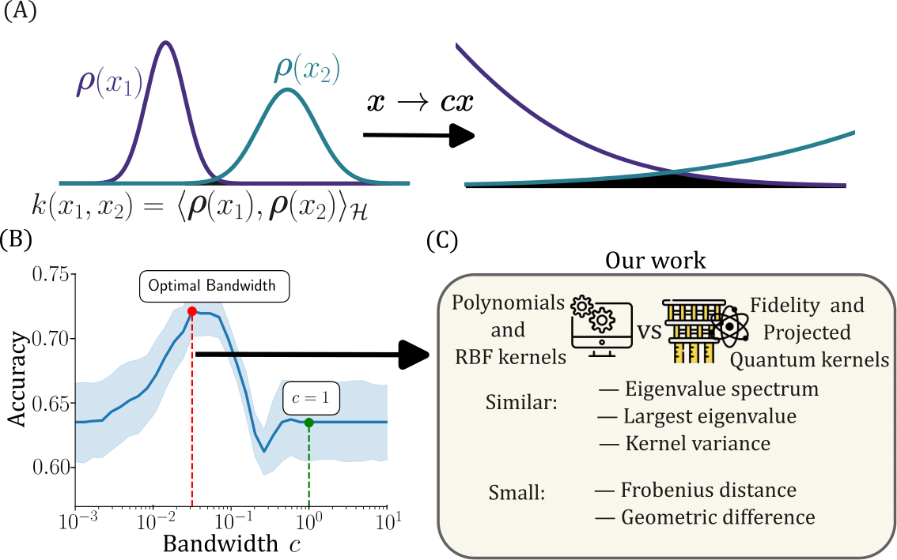

## On the similarity of bandwidth-tuned quantum kernels and classical kernels


Accompanying repository for the paper: [On the similarity of bandwidth-tuned quantum kernels and classical kernels](https://arxiv.org/pdf/2503.05602v1)

This repository is intended for reproducibility purposes, and is not optimized nor idealized for continuous use and development.

### Reproducing results
To calculate a QK described in experiments inputs, we do:

```bash
py -3 -m kernel_main #arbitrary_index #experiment_index #num_cores
```

`#arbitrary_index` corresponds to an arbitrary number used to keep track of the experiment. After the QKs simulations are done, one trains and predicts with the obtained kernels matrices by doing:

```bash
py -3 -m quantum_performance #arbitrary_index #experiment_index #num_cores
```

To obtain the similar corresponding classical simulations, one does:

```bash
py -3 -m classical_performance #arbitrary_index #experiment_index #num_cores
```

After the classical and quantum simulations are complete we compute the differences by calling:

```bash
py -3 -m all_difference_calculations #arbitrary_index #experiment_index #num_cores
```

For example, to test we can run the `test_simulations` (see bash file):

```bash
echo "Running classical simulations"
py -3 -m classical_performance 0 0 1 #test classic simulations
wait 
mv ./data/results/performance_classical_0_0 ./data/results/plasticc_test_classical
echo "Calculating quantum kernel simulations"
py -3 -m kernel_main 0 0 1
wait
echo "Training and running quantum simulations"
py -3 -m quantum_performance 0 0 1
wait
echo "Calculating differences between classical and quantum simulations"
py -3 -m all_difference_calculations 0 0 plasticc_test
wait
```

In practice, one only needs to run once `classical_performance` for every selected dataset. In `all_simulations.bash` we write all the explicit simulations lines used for the investigations. 

### Reproducing plots

In the `plotting` folder, we can find the notebooks to reproduce the paper figures.


### Contact

Roberto Flórez Ablan  
Fraunhofer Institute for Manufacturing Engineering and Automation IPA  
rflorezablan@gmail.com  

Jan Schnabel   
Fraunhofer Institute for Manufacturing Engineering and Automation IPA  
jan.schnabel@ipa.fraunhofer.de  


